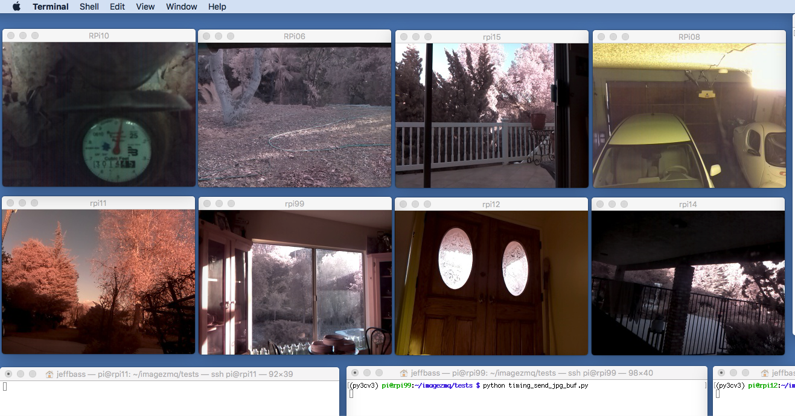

====================================
imagezmq: Transporting OpenCV images
====================================

Introduction
============

**imagezmq** is a set of Python classes that transport OpenCV images from one
computer to another using PyZMQ messaging. For example, here is a screen on a
Mac computer showing simultaneous video streams from 8 Raspberry Pi cameras:

Using **imagezmq**, this is possible with 11 lines of Python on each Raspberry
Pi and with 8 lines of Python on the Mac.

First, run this code on the Mac (or other display computer):

.. code-block:: python
  :number-lines:

    # run this program on the Mac to display image streams from multiple RPis
    import cv2
    import imagezmq
    image_hub = imagezmq.ImageHub()
    while True:  # show streamed images until Ctrl-C
        rpi_name, image = image_hub.recv_image()
        cv2.imshow(rpi_name, image) # 1 window for each RPi
        cv2.waitKey(1)
        image_hub.send_reply(b'OK')

Then, on each Raspberry Pi, run:

.. code-block:: python
  :number-lines:

    # run this program on each RPi to send a labelled image stream
    import socket
    import time
    from imutils.video import VideoStream
    import imagezmq

    sender = imagezmq.ImageSender(connect_to='tcp://jeff-macbook:5555')

    rpi_name = socket.gethostname() # send RPi hostname with each image
    picam = VideoStream(usePiCamera=True).start()
    time.sleep(2.0)  # allow camera sensor to warm up
    while True:  # send images as stream until Ctrl-C
        image = picam.read()
        sender.send_image(rpi_name, image)

Wow! A video surveillance system with 8 (or more!) Raspberry Pi cameras in
19 lines of Python.

See `About the multiple RPi video streaming examples (REQ/REP and PUB/SUB patterns) <docs/more-details.rst>`_
for more details about this example.

.. contents::

Why use imagezmq?
=================

**imagezmq** is an easy to use image transport mechanism for a distributed image
processing network. For example, a network of a dozen Raspberry Pis with cameras
can send images to a more powerful central computer. The Raspberry Pis perform
image capture and simple image processing like flipping, blurring and motion
detection. Then the images are passed via **imagezmq** to the central computer for
more complex image processing like image tagging, text extraction, feature
recognition, etc. An example of using **imagezmq** can be found
at `Using imagezmq in distributed computer vision projects <docs/imagezmq-uses.rst>`_

Features
========

- Sends OpenCV images from one computer to another using ZMQ.
- Can send jpeg compressed OpenCV images, to lighten network loads.
- Uses the powerful ZMQ messaging library through PyZMQ bindings.
- Allows a choice of 2 different ZMQ messaging patterns (REQ/REP or PUB/SUB).
- Enables the image hub to receive and process images from multiple image senders
  simultaneously.

Messaging Patterns: REQ/REP versus PUB/SUB
==========================================

ZMQ allows many different messaging patterns. Two are implemented in **imagezmq**:

- REQ/REP: Each RPi sends an image and waits for a REPLY from the central image
  hub. The RPi sends a new image only when the REPLY is received. In the REQ/REP
  messaging pattern, each image sender must await a REPLY before continuing. It is a
  "blocking" pattern for the sender.
- PUB/SUB: Each RPi sends an image, but does not expect a REPLY from the central
  image hub. It can continue sending images without awaiting any acknowledgement
  from the image hub. The image hub provides no REPLY. It is a "non-blocking"
  pattern for the sender.

There are advantages and disadvantages for each pattern. For further details,
see: (reference to be added). REQ/REP is the default.

Dependencies and Installation
=============================

**imagezmq** has been tested with:

- Python 3.5 and 3.6
- OpenCV 3.3
- Raspian Stretch and Raspian Jessie
- PyZMQ 16.0
- imutils 0.4.3 (used get to images from PiCamera)

OpenCV is challenging to install. I recommend using the installation
instructions at `PyImageSearch <https://www.pyimagesearch.com/>`_.
Adrian Rosebrock's PyImageSearch blog and books are great resources for
learning about and installing OpenCV on Raspberry Pi's, Macs and
Linux computers.

- `Raspbian Stretch: Install OpenCV 3 + Python on your Raspberry Pi
  <https://www.pyimagesearch.com/2017/09/04/raspbian-stretch-install-opencv-3-python-on-your-raspberry-pi/>`_
- `macOS: Install OpenCV 3 and Python 3.5
  <https://www.pyimagesearch.com/2016/12/05/macos-install-opencv-3-and-python-3-5/>`_
- `Ubuntu 16.04: How to install OpenCV
  <https://www.pyimagesearch.com/2016/10/24/ubuntu-16-04-how-to-install-opencv/>`_

Be sure to install OpenCV, including Numpy, into a Python Virtual Environment,
as shown in the above tutorials. Be sure to install the remaining packages
into the **same** virtual environment. In the examples below, my virtual
environment is named **py3cv3**.

Install PyZMQ using pip:

.. code-block:: bash

    workon py3cv3  # use your virtual environment name
    pip install pyzmq

Install imutils using pip:

.. code-block:: bash

    workon py3cv3  # use your virtual environment name
    pip install imutils

**imagezmq** is still in early development, so it is not yet in PyPI. Get it by
cloning the GitHub repository

.. code-block:: bash

    git clone https://github.com/jeffbass/imagezmq.git

Once you have cloned the imagezmq directory to a directory on your local machine,
you can run the tests per the instructions below. You can use imagezmq in your
own code by copying ``imagezmq.py`` to one of your project directories and
importing it (``import imagezmq``).

**imagezmq** and all of the software dependencies must be installed on the
display computer that will be receiving the images AND it must all be installed
on every Raspberry Pi that will be sending images. If you will be using multiple
Raspberry Pis to capture and send images it is best to install the software on a
single Raspberry Pi and test it using the tests below. Once all the tests
have run successfully, clone the SD card as needed to use the software on
multiple Raspberry Pis.

Running the Tests
=================

When running the tests, use multiple terminal windows on the computer that will
be displaying the images (I used a Mac for these examples; in my descriptions
I use the term "Mac" to refer to any Mac or Linux computer, including a
Raspbery Pi). One terminal window is used to launch the programs that run on the
Mac to receive the images. Another terminal window on the Mac is used to ssh
into the Raspberry Pi and run the image sending program. If sending from multiple
Raspberry Pis, ssh to each Raspberry Pi in a new terminal window. **imagezmq**
and its dependencies must be installed on the Mac and on each Raspberry Pi that
will be sending images.

There are 3 tests. Each of the tests uses 2 programs in matched pairs. One
program sends images and the other program displays images. Because of the
REQ/REP pattern that is being used, it is important that the receiving program
be started before the sending program.

**imagezmq** is in early development as part of a larger system. There are
currently separate methods for sending and receiving images vs. jpg compressed
images. Further development will refactor these into single methods for sending
and receiving. ::

Test 1: Simple generated images sent and displayed on Mac
---------------------------------------------------------
**The first test** runs both the sending program and the receiving program on
the Mac. This confirms that all the software is installed correctly and that
``cv2.imshow()`` works on the Mac. No Raspberry Pi or camera is involved. The
sending program generates test images and sends them to the receiving program.
First, in one terminal window, activate your virtual environment, then change to
the tests directory and run the receiving program, which will receive and
display images::

    workon py3cv3  # use your virtual environment name
    cd imagezmq/tests
    python test_1_receive_images.py

Then, in a second terminal window on the same display computer (Mac), change to
the tests directory and run the sending program, which will generate and send
images::

    workon py3cv3  # use your virtual environment name
    cd imagezmq/tests
    python test_1_send_images.py

After a few seconds, a ``cv2.imshow()`` window should open and display a green
square on a black background. Then it will display a red square on the same
black background. The display will alternate every 2 seconds until you stop both
programs by pressing Ctrl-C. It is normal to get a cascade of error messages
when stopping the program with Ctrl-C. This simple test program has no
try / except error trapping.

Test 2: Sending stream of OpenCV images from RPi(s) to Mac
----------------------------------------------------------
**The second test** runs the sending program on a Raspberry Pi, capturing
images from the PiCamera at up to 32 frames a second and sending them via
**imagezmq** to the Mac. The receiving program on the Mac displays a continuous
video stream of the images captured by the Raspberry Pi. First, in one terminal
window, activate your virtual environment, change to the tests directory and
run the receiving program which will display the images::

    workon py3cv3  # use your virtual environment name
    cd imagezmq/tests
    python test_2_receive_images.py

Then, in a second terminal window on the Mac, ssh into the Raspberry Pi that
will be sending images. Activate your Python virtual environment, change to the
tests directory and **edit the test_2_send_images.py program to specify the tcp
address of your display computer.** There are 2 lines in the program that show
different ways of specifying the tcp address: by hostname or by tcp numeric address.
Pick one method, change the tcp address to that of your display computer and
comment out the method you are not using. Finally, run the program, which will
capture and send images::

    workon py3cv3  # use your virtual environment name
    cd imagezmq/tests
    python test_2_send_images.py

In about 5 seconds, a ``cv2.imshow()`` window will appear on the Mac and display
the video stream being sent by the Raspberry Pi.  You can repeat this step in
additional terminal windows, to ssh into additional Raspberry Pi computers and
start additional video streams. The receiving program can receive and display
images from multiple Raspberry Pis, with each Raspberry Pi's image stream
showing in a separate window. For this to work, each Raspberry Pi must have a
unique hostname because the images are sorted into different
``cv2.imshow()`` windows based on the hostname. The ``cv2.imshow()`` windows
for multiple Raspberry Pi streams will be stacked on top of each other until you
drag them and arrange them on your desktop. The example picture at the start of
this documentation shows 8 simultaneous video streams for 8 Raspberry Pi
computers with different hostnames. Each program must be stopped by pressing
Ctrl-C in its terminal window. It is normal to get a cascade of error messages
when stopping these programs with Ctrl-C. This simple test program has no try /
except error trapping.

Test 3: Sending stream of jpgs from RPi(s) to Mac
-------------------------------------------------
**The third test** runs a different pair of sending / receiving programs. The
program on the Raspberry Pi captures images from the PiCamera at up to 32
frames a second and **compresses them to jpeg form** before sending them via
**imagezmq** to the Mac. The receiving program on the Mac converts the jpg
compressed frames back to OpenCV images and displays them as a continuous video
stream. This jpeg compression can greatly reduce the network load of sending many
images from multiple sources.

The programs that send and receive the images using jpg compression are run in
the same way as the above pair of programs that send uncompressed images. Use
the instructions above as a guide. The programs for Test 3 are::

    test_3_receive_jpg.py  # run on the Mac to receive & decompress images
    test_3_send_jpg.py     # ron on each Raspberry Pi to compress & send images

As with the previous Test 2 program pair, you will need to edit the "connect_to"
address in the sending program to the tcp address of your Mac (or other display
computer).  You will also need to remember to start the *receive* program on the
Mac before you start the sending program on the Raspberry Pi. As before, each
program must be stopped by pressing Ctrl-C in its terminal window. It is normal
to get a cascade of error messages when stopping these programs with Ctrl-C.
This simple test program has no try / except error trapping. Be sure to activate
your virtual environment as you did for Test 2 (see above) before running these
tests.

Timing tests: Complete imagezmq usage examples
==============================================
The test programs above are short and simple. They test that the software and
dependencies are installed correctly and that images transfer successfully between
a Raspberry Pi computer and a display computer such as a Mac.  The tests
directory contains 2 more send / receive program pairs that provide a more
complete example of imagezmq usage. Each of these programs includes
try / except blocks that enable ending the programs by typing Ctrl-C
without starting a cascade of error messages. They also perform frames per
second (FPS) timing tests that measure the speeds of image transfer using the
compressed versus the non-compressed transfer methods.

One pair of programs transmits and receives **OpenCV images** and measures FPS::

    timing_receive_images.py  # run on Mac to display images
    timing_send_images.py     # run on Raspberry Pi to send images

Another pair of programs transmits and receives **jpg compressed images** and
measures FPS::

    timing_send_jpg_buf.py     # run on Raspberry Pi to send images
    timing_receive_jpg_buf.py  # run on Mac to display images

As with the other test program pairs, you will need to edit the "connect_to"
address in the sending program to the tcp address of your Mac (or other display
computer).  You will also need to remember to start the *receive* program on the
Mac before you start the sending program on the Raspberry Pi. With these programs,
the try / except blocks will end the programs cleanly with no errors when you
press Ctrl-C. Be sure to activate your virtual environment before running these
tests.

Additional Documentation
========================
- `More details about the multiple RPi video streaming example <docs/more-details.rst>`_
- `Using imagezmq in distributed computer vision projects <docs/imagezmq-uses.rst>`_
- `API and Usage Examples <docs/api-examples.rst>`_
- How **imagezmq** is used in my own projects connecting multiple
  Raspberry Pi **imagenodes** to an **imagehub**:

  - My Yin Yang Ranch project to manage a small urban permaculture farm.
    `Yin Yang Ranch project overview. <https://github.com/jeffbass/yin-yang-ranch>`_
  - `imagenode: Capture and Send Images and Sensor Data. <https://github.com/jeffbass/imagenode>`_
  - `imagehub: Receive and Store Images and Event Logs. <https://github.com/jeffbass/imagehub>`_

Contributing
============
**imagezmq** is in early development and testing. I welcome open issues and
pull requests, but because the programs are still evolving, it is best to
open an issue with some discussion before submitting pull requests.

Contributors
============
Thanks for all contributions big and small. Some significant ones:

+------------------------+---------------+--------------------------------------------------+
| **Contribution**       | **Name**      | **GitHub**                                       |
+------------------------+---------------+--------------------------------------------------+
| Initial code & docs    | Jeff Bass     | `@jeffbass <https://github.com/jeffbass>`_       |
+------------------------+---------------+--------------------------------------------------+
| Added PUB / SUB option | Maksym        | `@bigdaddymax <https://github.com/bigdaddymax>`_ |
+------------------------+---------------+--------------------------------------------------+
| HTTP Streaming example | Maksym        | `@bigdaddymax <https://github.com/bigdaddymax>`_ |
+------------------------+---------------+--------------------------------------------------+

Acknowledgements and Thank Yous
===============================
- **ZeroMQ** is a great messaging library with great documentation
  at `ZeroMQ.org <http://zeromq.org/>`_.
- **PyZMQ** serialization examples provided a starting point for **imagezmq**. See the
  `PyZMQ documentation <https://pyzmq.readthedocs.io/en/latest/index.html>`_.
- **OpenCV** and its Python bindings provide great scaffolding for computer
  vision projects large or small: `OpenCV.org <https://opencv.org/>`_.
- **PyImageSearch.com** is the best resource for installing OpenCV and its Python
  bindings. Adrian Rosebrock provides many practical OpenCV techniques with
  tutorials, code examples, blogs
  and books at `PyImageSearch.com <https://www.pyimagesearch.com/>`_. Installing
  OpenCV on my Raspberry Pi computers, Macs and Linux boxes went from
  frustrating to easy thanks to his tutorials. I also learned a **LOT** about
  computer vision methods and techniques by taking his PyImageSearch Gurus
  course. Highly recommended.
- **imutils** is a collection of Python classes and methods that allows computer
  vision programs using OpenCV to be cleaner and more compact. It has a very
  helpful threaded image reader for Raspberry PiCamera modules or webcams. It
  allowed me to shorten my camera reading programs on the Raspberry Pi by half:
  `imutils on GitHub <https://github.com/jrosebr1/imutils>`_. **imutils** is an
  open source project authored by Adrian Rosebrock.
