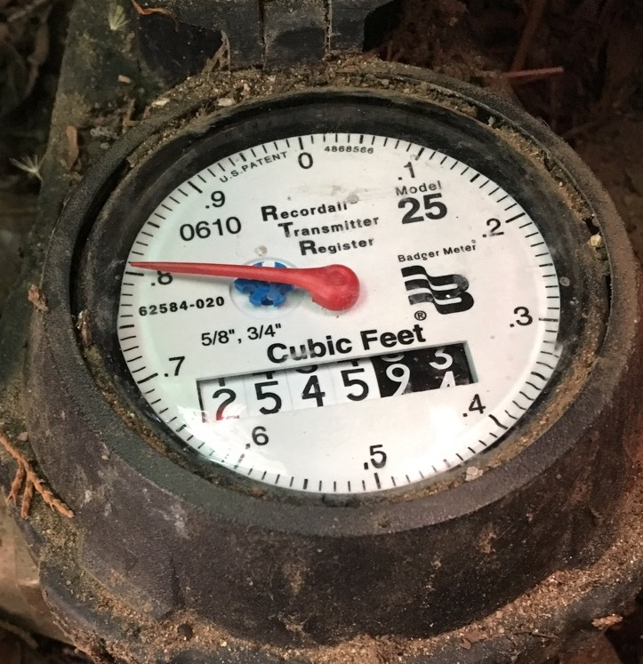

==========================================================
Using **imagezmq** in Distributed Computer Vision Projects
==========================================================

The test programs show how **imagezmq** can be used to capture images on
Raspberry Pi computers, send them to a Mac via **imagezmq** and then display
them on the Mac. The ability for one hub to gather and process images from
multiple sources allows computer vision pipelines to distribute vision processing
across multiple computers.

Let's walk through an example where **imagezmq** is used to distribute a
computer vision process across a Raspberry Pi and a Mac. This project involves
reading a water meter using a Raspberry Pi and PiCamera to gather images and do
some image processing locally. A program running on the Raspberry Pi selects
some images to be transmitted via **imagezmq** to a Mac for more complex
processing.

This is what a water meter looks like:

The goal of the project is to use computer vision to manage water use on a small
farm. I can use computer vision to determine if water is flowing or not, read
the gallons used per hour or per day, and save some of the images for analysis.
The project also watches for unusual water flow due to leaks or broken irrigation
controls and sends alerts. When the water is flowing, the large analog needle
spins clockwise. Each full rotation of the needle causes the rightmost
digit of the digital meter to advance by one digit. The small "blue star" dial
is a "leak detector" that spins even when a very small amount of water is
flowing (like a dripping faucet). This a great project for a Raspberry Pi,
**imagezmq** and a Mac (or Linux computer).

Here's what occurs on the Raspberry Pi:

- The PiCamera gets warmed up and an LED is turned on to illuminate the water
  meter (via the RPi GPIO pins).
- Images of the water meter are taken at 10 frames per second.
- The images are rotated, cropped and converted to grayscale.
- The images are thresholded and dilated.
- The images are pushed into a Queue as they are gathered.
- Pairs of images in the Queue are differenced to look for needle motion to
  determine if water is flowing or not.
- The water meter status (flowing or not flowing) is sent via **imagezmq**
  along with a series of images that show when the status changed (from flowing
  to not flowing or vice-versa). To minimize network load, images are only sent
  when there has been a status change. The program logic to select which images
  to send is running in a thread on the Raspberry Pi.
- The program ``timing_send_jpg_buf`` in the ``imagezmq/tests`` folder is a
  simplified code outline for the actual Raspberry Pi image capture and sending
  program in my distributed computer vision pipeline. An image sending
  class is instantiated before the ``try -- while -- except`` loop and an image
  processing (rotation, cropping, thresholding, etc.) method is called inside
  the loop.

Here's what occurs on the Mac:

- The images are received via **imagezmq** along with the status messages.
- The images are stored in an image database and indexed.
- Several Regions of Interest (ROI) are extracted from each image and further
  processed:

  - An ROI containing the digital digits portion of the meter face is masked and
    the digits are extracted to compute the numeric value of the meter digits.
    A customized digit classifier algorithm is used on the extracted digits.
  - An ROI containing the "leak detector" is masked and analyzed to create
    an alert if there are leaks or irrigation failures.

- Current water state (flowing or not flowing), water state history, images of
  interest and gallons used are analyzed and put into a database.
- Other programs running on the Mac access the database to answer queries about
  water status, gallons used per hour, per day or per week, etc.
- Another program on the Mac sends text alerts in case of water leaks or irrigation
  control issues.
- The program ``timing_receive_jpg_buf`` in the ``imagezmq/tests`` folder is a
  simplified code outline for the actual Mac image receiving program in my
  distributed computer vision pipeline. An image processing class is
  instantiated before the ``try -- while -- except`` loop and an image processing
  method is called inside the loop that extracts an ROI and does feature
  extraction and digit classification.

**imagezmq** optimizes this Raspberry Pi to Mac computer vision pipeline in a
way that allows each computer to do tasks for which it is best suited:

- No images are stored on the Raspberry Pi. The SD Card storage on the Raspberry
  Pi is very slow for writing large binary image files. Also, there have been
  reports of SD card failures caused by frequent writes of large binary files.
- The Raspberry Pi can control the lighting to gather the best images.
- The Raspberry Pi can do simple image processing, motion detection and can use
  an algoritm to select which images to send via **imagezmq**.
- The Mac can use its larger memory and faster CPU to do more complex image
  processing, including feature extraction and digit classification.
- The Mac can use its fast SSD disk drives to store the images and the extracted
  features of images.
- One Mac can act as a processing hub for multiple Raspberry Pi computers
  sending image and other sensor data. I am running about 8 Raspberry Pi
  computers for each Mac (or Linux computer).

In addition to using a Raspberry Pi to read the water meter, I have Raspberry
Pis running similar software watching the garage and barn doors, watching the farm
for critters, tracking the weather and solar panels, etc. One Mac can easily
act as a hub for 8 or more Raspberry Pi computers that are doing simple image
processing, motion detection and sending a subset of gathered images. The Mac
has enough processing power to do further image processing for all 8 Raspberry Pi
image streams.

The code for the Raspberry Pi water meter **imagenode** program can be found on
GitHub at
`imagenode: Capture and Send Images and Sensor Data. <https://github.com/jeffbass/imagenode>`_
The Mac (or other Linux computer) **imagehub** program can be found on GitHub at
`imagehub: Receive and Store Images and Event Logs. <https://github.com/jeffbass/imagehub>`_
The overall project description of the farm automation software and hardware can
be found on GitHub at
`Yin Yang Ranch. <https://github.com/jeffbass/yin-yang-ranch>`_

`Return to main documentation page README.rst <../README.rst>`_
